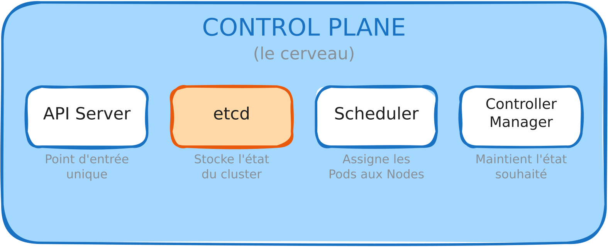

# Le Control Plane

##### Le Control Plane de Kubernetes

Le **control plane** regroupe l’ensemble des composants responsables de la gestion, de la prise de décision et de la cohérence globale du cluster. Il **ne lance jamais directement les conteneurs**, mais définit l’état désiré du cluster et veille à ce qu’il soit respecté.

On peut le comparer à un ensemble de **services centraux d’administration** :

- un annuaire (source de vérité)

- un ordonnanceur global

- des moteurs d’automatisation

###### kube-apiserver

Le **kube-apiserver** est le **point d’entrée unique du cluster**.
Toutes les interactions (CLI, UI, API, etc.) passent par lui. Ses fonctions principales sont :

- valider les requêtes (authentification, autorisation, admission)

- enregistrer l’état désiré du cluster dans **etcd**

- notifier les autres composants des changements

**À noter :** l’API Server **n’exécute pas les actions** sur le cluster. Elle **enregistre l’intention** et laisse les autres composants réaliser les changements.

###### etcd

**etcd** est une **base de données clé-valeur distribuée** qui contient l’état complet du cluster : c’est sa mémoire.

- Sans etcd, Kubernetes **ne sait plus quels pods ou services doivent être exécutés**.

- La **sauvegarde d’etcd** est donc critique en production.

###### kube-scheduler

Le **scheduler** décide **sur quel nœud exécuter chaque pod**.
Il prend en compte :

- les ressources disponibles (CPU, mémoire)

- les contraintes (taints, tolerations)

- les affinités et anti-affinités

C’est l’équivalent d’un **ordonnanceur d’hyperviseur** pour les workloads Kubernetes.

###### kube-controller-manager

Le **controller manager** exécute les **contrôleurs**, qui suivent des boucles de réconciliation :

1. Comparer l’état réel du cluster avec l’état désiré (défini dans etcd)

2. Corriger les écarts en appliquant les changements nécessaires

Il agit comme **le moteur d’auto-réparation du cluster**, maintenant le cluster dans l’état souhaité de façon continue.

