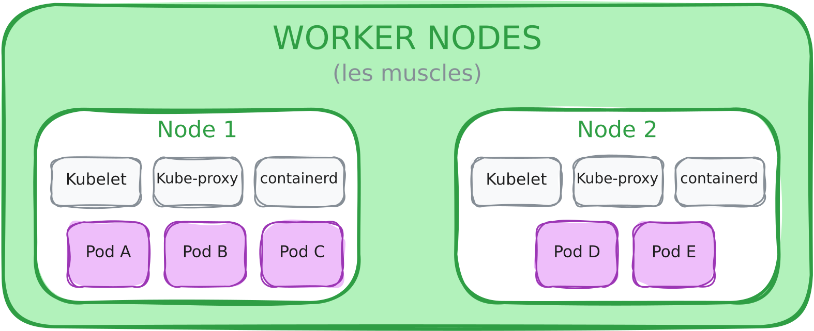

# Les Worker Nodes

##### Les Worker Nodes de Kubernetes

Les **worker nodes** sont les **machines qui exécutent réellement les workloads** (pods, conteneurs).
Chaque nœud de travail reçoit les instructions du **control plane** et veille à ce que l’état désiré du cluster soit appliqué localement.

On peut les comparer à des **serveurs d’exécution**, où chaque conteneur trouve son environnement et ses ressources.

###### kubelet

Le **kubelet** est l’agent principal sur chaque worker node.

- Il communique avec le **kube-apiserver** pour récupérer l’état désiré des pods.

- Il s’assure que les **pods sont créés, exécutés et maintenus** selon les spécifications.

- Il remonte l’état réel du nœud et des pods au control plane.

**À noter :** le kubelet **ne décide pas où les pods doivent aller** : il suit les instructions du scheduler.

###### kube-proxy

Le **kube-proxy** gère la **connectivité réseau** et le **load-balancing** sur le nœud :

- Il met en place les règles pour que les pods puissent communiquer entre eux et avec l’extérieur.

- Il peut utiliser différents modes (iptables, IPVS) pour distribuer le trafic.

Cela garantit que les services Kubernetes sont **accessibles et équilibrés**, sans que chaque pod doive connaître les détails du réseau.

###### Container Runtime

Le **container runtime** est le moteur qui **exécute réellement les conteneurs** sur le nœud.
Exemples : Docker, containerd, CRI-O.

- Il reçoit les instructions du kubelet pour **lancer, arrêter ou gérer les conteneurs**.

- Il s’assure que chaque conteneur dispose des ressources nécessaires et de son isolation.

**Important :** Kubernetes ne lance jamais directement les conteneurs : le kubelet délègue cette tâche au runtime.

