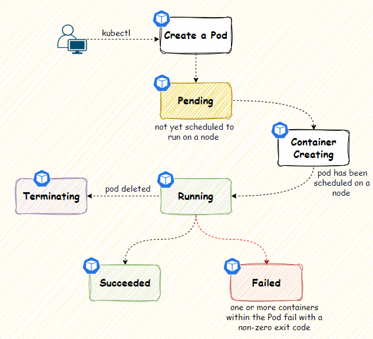

# Pods, lifecycle et probes

##### Le Pod : unité minimale d’exécution

Le **pod** est **l’unité de base de Kubernetes**.

- Il est **éphémère et remplaçable**, un peu comme un **processus supervisé** par le cluster.

- Un pod peut contenir **un ou plusieurs conteneurs** partageant le même réseau et le même stockage.

###### Lifecycle d’un Pod

Le cycle de vie d’un pod est volontairement simple et suit ces états :

État
Signification

**Pending**
Le pod est accepté par le cluster mais **pas encore exécuté**

**Running**
Le pod est **en cours d’exécution** sur un nœud

**Succeeded / Failed**
Le pod est **terminé**, avec succès ou échec

**Unknown**
L’état du pod **ne peut pas être déterminé**

**À noter :** ces états reflètent l’exécution du pod, **pas l’état interne de l’application**.

###### Les Probes : relier Kubernetes à la réalité applicative

Pour gérer correctement un pod, Kubernetes utilise des **probes** qui vérifient l’état réel de l’application :

Probe
Rôle

**liveness**
L’application est-elle vivante ? Faut-il redémarrer le pod ?

**readiness**
Le pod est-il prêt à recevoir du trafic ?

**startup**
L’application a-t-elle fini de démarrer correctement ?

**À noter** :

- Sans probes, Kubernetes ne sait que si le conteneur fonctionne ou non, mais **ignore si l’application à l’intérieur est réellement prête**.

- Avec probes, Kubernetes peut **redémarrer, router ou bloquer le trafic** selon la réalité applicative.

