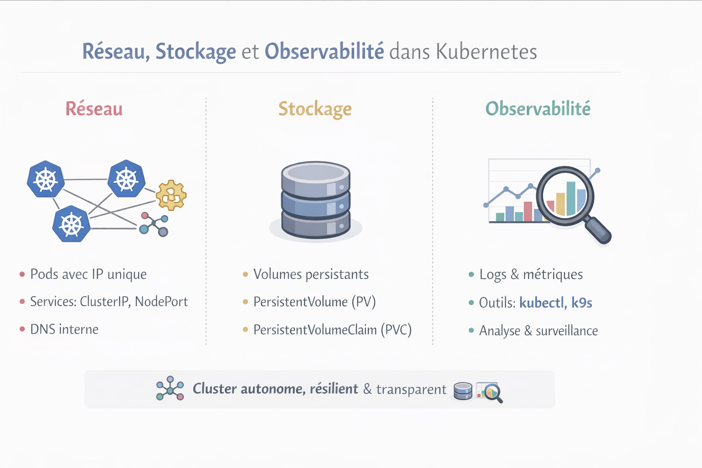

# Réseau, stockage et observabilité

Kubernetes ne se limite pas à faire tourner des pods. Pour être pleinement fonctionnel, un cluster doit gérer **le réseau**, **le stockage** et permettre **l’observabilité** de ce qui se passe à l’intérieur. Ces trois aspects sont essentiels pour comprendre comment Kubernetes maintient un état désiré.

##### Réseau dans Kubernetes

Le réseau est le **ciment** qui relie tous les composants d’un cluster.

###### Concepts clés

- **Pod-to-Pod** : chaque pod a sa propre IP. Kubernetes assure que tous les pods peuvent communiquer, **sans NAT**, grâce au CNI (Container Network Interface).

- **Service** : abstraction qui permet d’exposer un ou plusieurs pods sous une adresse stable. Exemples :

  - `ClusterIP` : accessible uniquement à l’intérieur du cluster

  - `NodePort` : accessible depuis l’extérieur via un port du nœud

  - `LoadBalancer` : permet de gérer la répartition du trafic

- **DNS interne** : Kubernetes crée automatiquement des noms de service (`myservice.default.svc.cluster.local`) pour simplifier la communication.

**Pourquoi c’est important**

Le réseau Kubernetes permet :

- aux pods de se retrouver automatiquement

- aux applications d’évoluer ou de se déplacer sans changer de configuration réseau

- de garantir que les services restent joignables malgré les pannes ou redémarrages

##### Stockage dans Kubernetes

Les pods sont **éphémères** : lorsqu’un pod est supprimé, ses données disparaissent. Kubernetes utilise donc des **volumes** pour gérer la persistance.

###### Concepts clés

- **Volume** : espace de stockage attaché à un pod

- **PersistentVolume (PV)** : ressource de stockage abstraite, indépendante du pod

- **PersistentVolumeClaim (PVC)** : demande de stockage par un pod

- **Types de stockage** :

  - Local : disque attaché au nœud

  - Réseau : NFS, iSCSI, ou solutions cloud (EBS, Azure Disk, GCP Persistent Disk)

**Pourquoi c’est important**

- Permet de séparer **cycle de vie des données** et **cycle de vie des pods**

- Permet aux applications d’être **stateless** côté pod, mais **stateful** côté stockage

- Facilite la **haute disponibilité** et la **migration de workloads**

##### Observabilité dans Kubernetes

Observabilité signifie pouvoir **savoir ce qui se passe** dans le cluster et dans les applications.

###### Concepts clés

- **Logs** : journaux de chaque pod ou container (`kubectl logs`)

- **Metrics** : mesures de performance (CPU, mémoire, réseau)

- **Events** : notifications sur les changements d’état (`kubectl get events`)

- **Outils d’observabilité** :

  - `kubectl` pour l’inspection en ligne de commande

  - `k9s` pour une vue interactive

  - Prometheus / Grafana pour la collecte et la visualisation (optionnel pour labs avancés)

**Pourquoi c’est important**

- Kubernetes agit pour rapprocher l’état réel de l’état désiré

- Sans visibilité, il est impossible de comprendre pourquoi un pod reste en `Pending` ou en `CrashLoopBackOff`

- L’observabilité permet d’apprendre à **anticiper les problèmes et à diagnostiquer les pannes**

