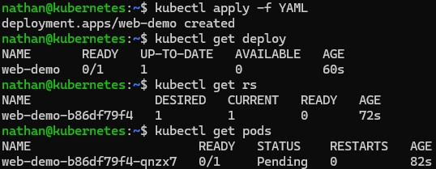

# Étape 1 – Déployer une application simple via un Deployment

**Créer un Deployment minimal :**

```yaml
cat <<'YAML' | kubectl apply -f -
apiVersion: apps/v1
kind: Deployment
metadata:
  name: web-demo
spec:
  replicas: 1
  selector:
    matchLabels:
      app: web
  template:
    metadata:
      labels:
        app: web
    spec:
      containers:
      - name: nginx
        image: nginx:1.25
        ports:
        - containerPort: 80
YAML
```

**Observer les ressources créées :**

```bash
kubectl get deploy
kubectl get rs
kubectl get pods
```

**Constat attendu :**

- un Deployment existe.

- un ReplicaSet est créé automatiquement,

- un pod est lancé par le ReplicaSet.

<details>

<summary><strong>Résultat</strong></summary>



**Interprétation :**

Le Deployment web-demo représente l’état désiré de l’application. Kubernetes crée automatiquement un ReplicaSet associé, puis ce ReplicaSet crée les pods nécessaires pour atteindre le nombre de replicas demandé.

Le pod n’est donc pas géré directement par l’utilisateur : il est contrôlé par le ReplicaSet, lui-même contrôlé par le Deployment. Cette chaîne de contrôle permet à Kubernetes de maintenir l’application dans l’état demandé.

</details>
