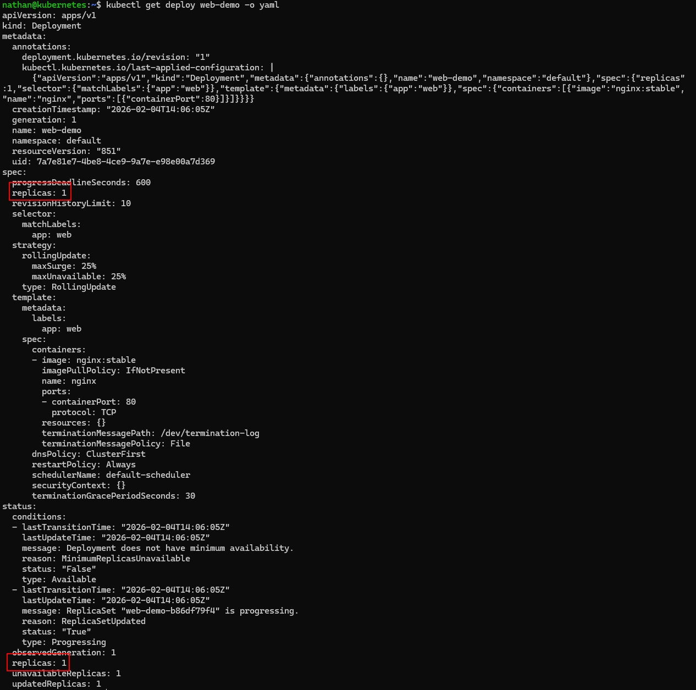

# Étape 2 – Observer l’état désiré et l’état réel

**Afficher la ressource Deployment telle qu’elle est stockée dans Kubernetes :**

```bash
kubectl get deploy web-demo -o yaml
```

**Identifier :**

- `spec.replicas` : l’état désiré,

- `status.replicas` / `status.readyReplicas` : l’état observé.

**Constat attendu :**

- `spec.replicas` représente l’état désiré déclaré par l’utilisateur,

- `status.replicas` et `status.readyReplicas` représentent l’état réellement observé par Kubernetes,

- le Deployment compare en permanence ces deux états pour maintenir la convergence.

<details>

<summary><strong>Résultat</strong></summary>



**Interprétation :**

La section spec décrit ce que l’utilisateur demande à Kubernetes, par exemple le nombre de replicas souhaité. La section status décrit ce que Kubernetes observe réellement dans le cluster.

Si spec.replicas et status.readyReplicas sont identiques, cela signifie que l’état réel correspond à l’état désiré. Kubernetes fonctionne en continu selon ce principe de réconciliation entre l’état demandé et l’état observé.

</details>
