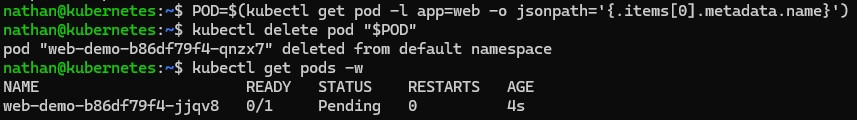

# Étape 3 – Supprimer manuellement le pod

**Lister le pod, puis le supprimer :**

```bash
POD=$(kubectl get pod -l app=web -o jsonpath='{.items[0].metadata.name}')
kubectl delete pod "$POD"
```

**Observer en temps réel :**

```bash
kubectl get pods -w
```

**Constat attendu :**

- le pod est immédiatement recréé,

- le nouveau pod a un nom différent,

- aucune action manuelle n’est nécessaire.

<details>

<summary><strong>Résultat</strong></summary>



**Interprétation :**

La suppression manuelle du pod ne supprime pas l’application, car le pod appartient à un ReplicaSet. Dès que Kubernetes constate qu’un replica manque, il crée automatiquement un nouveau pod pour revenir à l’état désiré.

Le nouveau pod possède un nom différent, ce qui montre qu’il ne s’agit pas d’un redémarrage du même pod, mais bien de la création d’une nouvelle instance.

</details>
