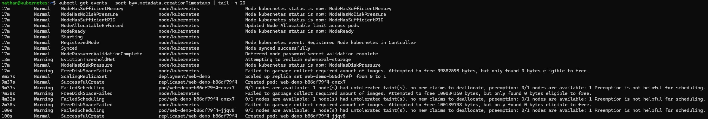

# Étape 4 – Analyser les événements

**Consulter les événements récents :**

```bash
kubectl get events --sort-by=.metadata.creationTimestamp | tail -n 20
```

**Identifier :**

- l’intervention du ReplicaSet,

- la logique de réconciliation appliquée par le controller.

**Constat attendu :**

- les événements montrent la suppression de l’ancien pod,

- le ReplicaSet déclenche automatiquement la création d’un nouveau pod,

- la logique de réconciliation est visible dans les événements du cluster.

<details>

<summary><strong>Résultat</strong></summary>



**Interprétation :**

Les événements permettent de suivre les actions réalisées par Kubernetes. Ils montrent la suppression de l’ancien pod, puis la création et le démarrage d’un nouveau pod.

Ces événements confirment que Kubernetes ne se contente pas d’exécuter des commandes : il surveille l’état du cluster et applique automatiquement les corrections nécessaires pour respecter l’état déclaré.

</details>
