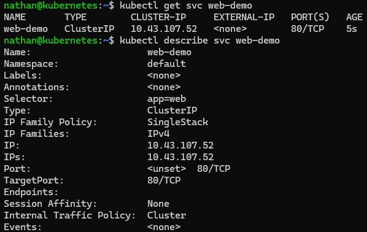

# Étape 1 – Créer un Service ClusterIP

**Créer le Service suivant** :

```yaml
cat <<'YAML' | kubectl apply -f -
apiVersion: v1
kind: Service
metadata:
  name: web-demo
spec:
  selector:
    app: web
  ports:
  - port: 80
    targetPort: 80
YAML
```

**Observer le Service :**

```bash
kubectl get svc web-demo
kubectl describe svc web-demo
```

**Constat attendu :**

- le Service possède une IP stable interne de type ClusterIP,

- il ne référence aucun pod explicitement,

- il sélectionne dynamiquement les pods à partir du label `app=web`.

<details>

<summary><strong>Résultat</strong></summary>



**Interprétation :**

Le Service `web-demo` fournit une adresse IP stable à l’intérieur du cluster. Cette IP ne dépend pas directement des pods, dont les adresses peuvent changer à chaque recréation.

Le Service utilise son selector pour identifier dynamiquement les pods portant le label `app=web`. Il joue donc le rôle de point d’accès réseau stable vers un ensemble de pods potentiellement changeants.

</details>
