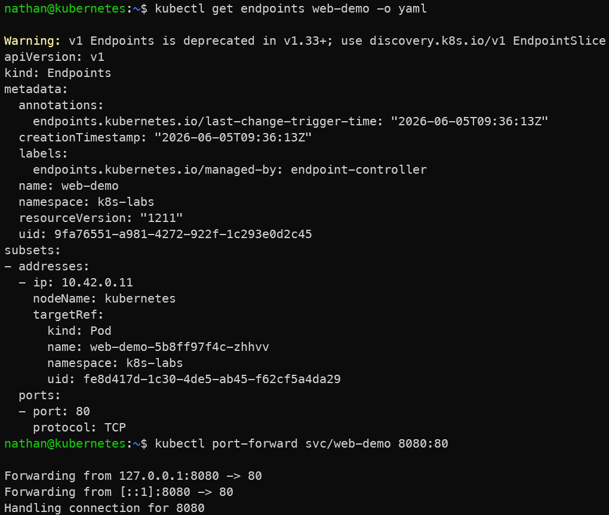
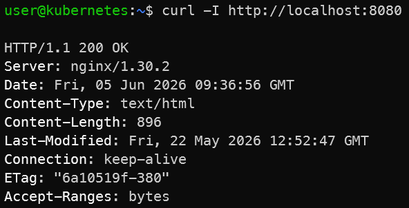

# Étape 2 – Vérifier les endpoints

**Lister les endpoints associés au Service :**

```bash
kubectl get endpoints web-demo -o yaml
```

**Observer :**

- les IP correspondent aux pods actuels,

- les endpoints changent si les pods sont recréés.

**Tester l’accès via port‑forward :**

```bash
kubectl port-forward svc/web-demo 8080:80
```

**Dans un autre terminal**

```text
curl -I http://localhost:8080
```

**Constat attendu :**

- les endpoints du Service correspondent aux IP des pods sélectionnés,

- le Service route le trafic vers les pods via ces endpoints,

- l’accès par port-forward permet de tester le Service sans exposer l’application à l’extérieur du cluster.

<details>

<summary><strong>Résultat</strong></summary>



****

**Interprétation :**

Les endpoints correspondent aux adresses IP réelles des pods sélectionnés par le Service. Ils représentent les cibles vers lesquelles le Service peut router le trafic.

Le port-forward permet de tester localement l’accès au Service sans créer d’exposition externe. Cela confirme que le Service fonctionne correctement à l’intérieur du cluster.

</details>
