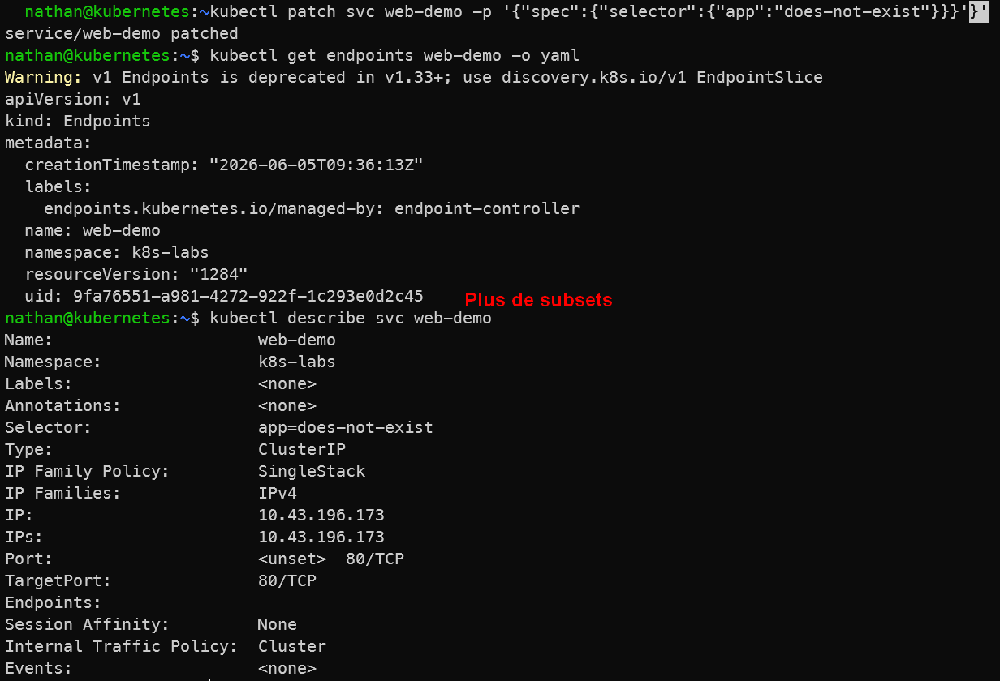

# Étape 3 – Introduire une erreur de selector

**Modifier volontairement le selector pour qu’il ne corresponde à aucun pod :**

```bash
kubectl patch svc web-demo -p '{"spec":{"selector":{"app":"does-not-exist"}}}'
```

**Observer :**

```bash
kubectl get endpoints web-demo -o yaml
kubectl describe svc web-demo
```

**Constat attendu :**

- le Service existe toujours,

- les endpoints sont vides,

- le trafic ne route plus.

<details>

<summary><strong>Résultat</strong></summary>



**Interprétation :**

Le Service existe toujours, mais il ne trouve plus aucun pod correspondant à son selector. Il ne dispose donc plus d’endpoints.

Cette situation montre qu’un Service peut être correctement créé tout en étant inutilisable si ses labels et selectors ne correspondent pas aux labels des pods. Le problème est alors un problème de sélection, pas un problème de réseau ou de disponibilité du Service.

</details>
