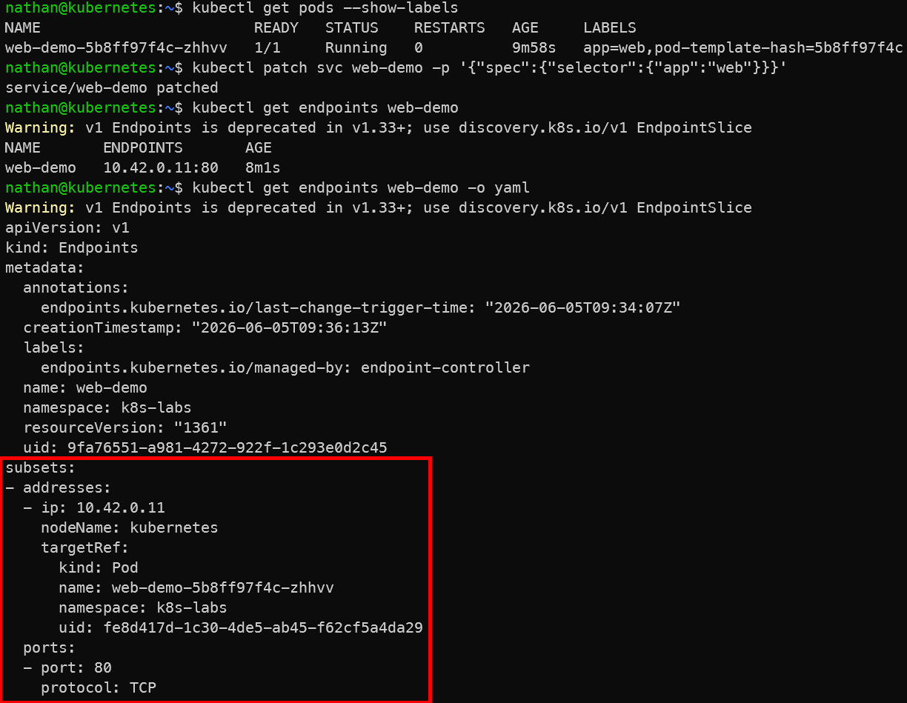

# Étape 4 – Diagnostic et correction

**Vérifier les labels des pods :**

```bash
kubectl get pods --show-labels
```

**Corriger le selector :**

```bash
kubectl patch svc web-demo -p '{"spec":{"selector":{"app":"web"}}}'
```

**Vérifier le retour à la normale :**

```bash
kubectl get endpoints web-demo
```

**Constat attendu :**

- les labels des pods permettent d’identifier pourquoi le Service ne trouvait plus d’endpoints,

- la correction du selector réassocie le Service aux bons pods,

- les endpoints réapparaissent lorsque la correspondance labels/selectors est rétablie.

<details>

<summary><strong>Résultat</strong></summary>



**Interprétation :**

La comparaison entre les labels des pods et le selector du Service permet d’identifier l’origine de l’incident. Une fois le selector corrigé avec la valeur app=web, Kubernetes reconstruit automatiquement la liste des endpoints.

Le Service redevient fonctionnel dès qu’il retrouve des pods correspondant à ses critères de sélection. Cela montre l’importance de la cohérence entre labels et selectors dans Kubernetes.

</details>
