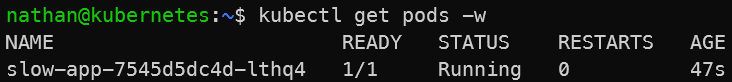

# Étape 1 – Déployer une application à démarrage lent sans probes

Nous allons déployer une application qui met volontairement du temps à démarrer, sans déclarer de probes.

```yaml
cat <<'YAML' | kubectl apply -f -
apiVersion: apps/v1
kind: Deployment
metadata:
  name: slow-app
spec:
  replicas: 1
  selector:
    matchLabels:
      app: slow-app
  template:
    metadata:
      labels:
        app: slow-app
    spec:
      containers:
      - name: app
        image: busybox:1.36
        command: ["/bin/sh","-c"]
        args:
        - |
          echo "Starting...";
          sleep 20;
          echo "App ready";
          nc -lk -p 8080
        ports:
        - containerPort: 8080
YAML
```

**Observer l’état du pod :**

```bash
kubectl get pods -w
```

**Constat attendu :** le pod passe rapidement en `Running`.

<details>

<summary><strong>Résultat</strong></summary>



**Interprétation :**

Le pod passe en état Running dès que le conteneur est lancé, même si l’application à l’intérieur du conteneur n’est pas encore prête à répondre.

L’état Running indique donc que le processus du conteneur existe, mais il ne garantit pas que l’application soit disponible fonctionnellement. C’est une distinction importante entre l’état du conteneur et l’état applicatif.

</details>
