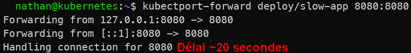

# Étape 2 – Constater la différence entre Running et disponibilité

**Tester l’accès à l’application via un port-forward :**

```bash
kubectl port-forward deploy/slow-app 8080:8080
```

**Dans un autre terminal**

```bash
nc localhost 8080
```

**Constat attendu** : pendant ~20 secondes, l’application ne répond pas alors que le pod est `Running`.

<details>

<summary><strong>Résultat</strong></summary>



**Interprétation :**

Le test réseau montre que l’application ne répond pas immédiatement, alors que le pod est déjà affiché comme Running. Kubernetes considère que le conteneur est lancé, mais il ne sait pas encore si l’application est réellement prête.

Sans readiness probe, Kubernetes peut considérer trop tôt qu’un pod est utilisable. Dans un contexte avec Service, cela peut conduire à router du trafic vers une application qui n’est pas encore disponible.

</details>
