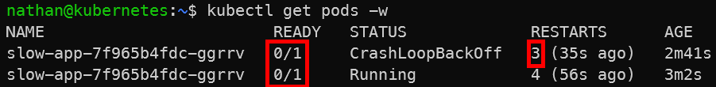

# Étape 3 – Ajouter une readiness probe

Ajouter une readiness probe pour empêcher Kubernetes de router le trafic trop tôt.

```yaml
cat <<'YAML' | kubectl apply -f -
apiVersion: apps/v1
kind: Deployment
metadata:
  name: slow-app
spec:
  replicas: 1
  selector:
    matchLabels:
      app: slow-app
  template:
    metadata:
      labels:
        app: slow-app
    spec:
      containers:
      - name: app
        image: busybox:1.36
        command: ["/bin/sh","-c"]
        args:
        - |
          sleep 20;
          nc -lk -p 8080
        ports:
        - containerPort: 8080
        readinessProbe:
          tcpSocket:
            port: 8080
          periodSeconds: 2
          failureThreshold: 3
YAML
```

**Observer :**

```bash
kubectl get pods -w
kubectl describe pod -l app=slow-app | sed -n '/Conditions:/,/Events:/p'
```

**Constat attendu** : le pod reste `0/1` Ready tant que l’application n’écoute pas.

<details>

<summary><strong>Résultat</strong></summary>



**Interprétation :**

La readiness probe permet à Kubernetes de distinguer un conteneur démarré d’une application réellement prête. Tant que le test de readiness échoue, le pod reste en état `0/1 Ready`.

Cette mécanique empêche Kubernetes d’envoyer du trafic vers un pod qui n’est pas encore opérationnel. Elle améliore donc la disponibilité perçue de l’application pendant les démarrages, redéploiements et mises à jour.

</details>
