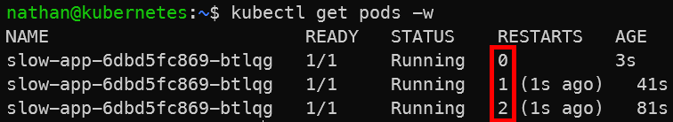

# Étape 4 – Introduire une liveness probe trop agressive

Ajouter une liveness probe volontairement mal configurée.

```yaml
cat <<'YAML' | kubectl apply -f -
apiVersion: apps/v1
kind: Deployment
metadata:
  name: slow-app
spec:
  replicas: 1
  selector:
    matchLabels:
      app: slow-app
  template:
    metadata:
      labels:
        app: slow-app
    spec:
      containers:
      - name: app
        image: busybox:1.36
        command: ["/bin/sh","-c"]
        args:
        - |
          sleep 20;
          nc -lk -p 8080
        ports:
        - containerPort: 8080
        livenessProbe:
          tcpSocket:
            port: 8080
          initialDelaySeconds: 5
          periodSeconds: 5
          failureThreshold: 1
YAML
```

**Observer les redémarrages** :

```bash
kubectl get pods -w
kubectl describe pod -l app=slow-app | sed -n '/Events:/,$p'
```

**Constat attendu :**

- le conteneur redémarre en boucle car la liveness probe échoue avant que l’application soit prête,

- les événements indiquent des échecs de probe et des redémarrages du conteneur,

- une liveness probe trop agressive peut dégrader une application pourtant fonctionnelle après son démarrage complet.

<details>

<summary><strong>Résultat</strong></summary>



**Interprétation :**

La liveness probe est exécutée avant que l’application ait terminé son démarrage. Comme le test échoue, Kubernetes considère le conteneur comme défaillant et le redémarre.

Le conteneur entre alors dans une boucle de redémarrage : il n’a jamais le temps d’atteindre son état nominal. Ce scénario montre qu’une mauvaise configuration de liveness probe peut provoquer une panne au lieu de la corriger.

</details>
