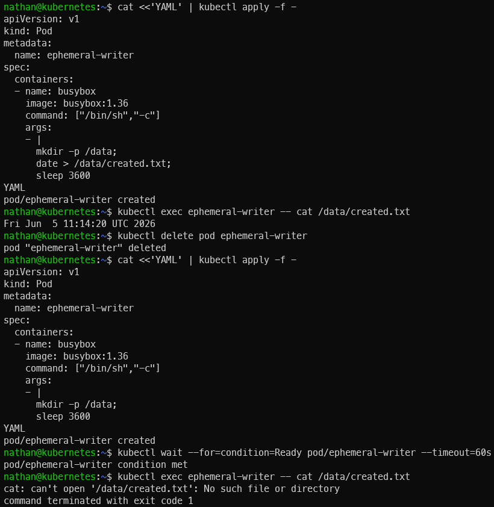

# Étape 1 – Démontrer la perte de données sans PVC

**Créer un pod qui écrit une donnée locale :**

```yaml
cat <<'YAML' | kubectl apply -f -
apiVersion: v1
kind: Pod
metadata:
  name: ephemeral-writer
spec:
  containers:
  - name: busybox
    image: busybox:1.36
    command: ["/bin/sh","-c"]
    args:
    - |
      mkdir -p /data;
      date > /data/created.txt;
      sleep 3600
YAML
```

**Lire la donnée :**

```bash
kubectl exec ephemeral-writer -- cat /data/created.txt
```

**Supprimer et recréer le pod :**

```bash
kubectl delete pod ephemeral-writer
```

```yaml
cat <<'YAML' | kubectl apply -f -
apiVersion: v1
kind: Pod
metadata:
  name: ephemeral-writer
spec:
  containers:
  - name: busybox
    image: busybox:1.36
    command: ["/bin/sh","-c"]
    args:
    - |
      mkdir -p /data;
      sleep 3600
YAML
```

```bash
kubectl wait --for=condition=Ready pod/ephemeral-writer --timeout=60s
```

```bash
kubectl exec ephemeral-writer -- cat /data/created.txt
```

**Constat attendu :**

- la commande cat échoue car le fichier `/data/created.txt` n’existe plus.

- La donnée était stockée dans le système de fichiers local du conteneur précédent.

- La suppression du pod a donc supprimé l’état local associé à ce pod.

<details>

<summary><strong>Résultat</strong></summary>



**Interprétation :**

Le fichier créé dans `/data` appartient au système de fichiers local du conteneur. Lors de la suppression du pod, cet état local disparaît avec l’ancienne instance.

La recréation du pod ne restaure pas le fichier, car aucun volume persistant n’a été utilisé. Cela démontre que le stockage local d’un conteneur est éphémère et ne doit pas être utilisé pour conserver des données importantes.

</details>
