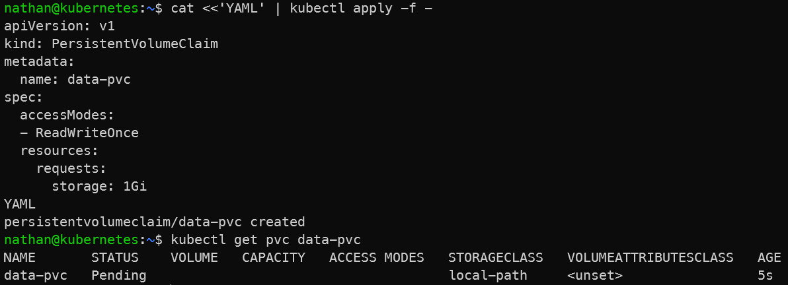

# Étape 2 – Créer un PersistentVolumeClaim

```yaml
cat <<'YAML' | kubectl apply -f -
apiVersion: v1
kind: PersistentVolumeClaim
metadata:
  name: data-pvc
spec:
  accessModes:
  - ReadWriteOnce
  resources:
    requests:
      storage: 1Gi
YAML
```

**Vérifier l’état du PVC :**

```bash
kubectl get pvc data-pvc
```

**Constat attendu :**

- le PVC data-pvc est créé,

- son état devient Bound lorsqu’un volume persistant lui est associé,

- le stockage demandé est désormais découplé du cycle de vie d’un pod.

<details>

<summary><strong>Résultat</strong></summary>



**Interprétation :**

Le PVC `data-pvc` représente une demande de stockage formulée par l’application. Kubernetes cherche ensuite à associer cette demande à un volume persistant disponible ou à en provisionner un automatiquement via une StorageClass.

Lorsque le PVC passe en état `Bound`, cela signifie qu’un volume persistant est associé à la demande. Le stockage devient alors indépendant du cycle de vie des pods qui l’utiliseront.

</details>
