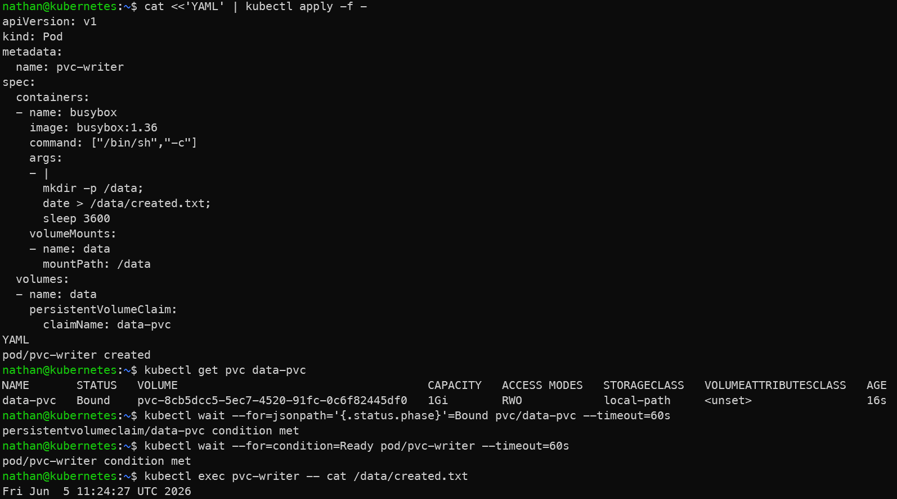

# Étape 3 – Attacher le PVC à un pod

```yaml
cat <<'YAML' | kubectl apply -f -
apiVersion: v1
kind: Pod
metadata:
  name: pvc-writer
spec:
  containers:
  - name: busybox
    image: busybox:1.36
    command: ["/bin/sh","-c"]
    args:
    - |
      mkdir -p /data;
      date > /data/created.txt;
      sleep 3600
    volumeMounts:
    - name: data
      mountPath: /data
  volumes:
  - name: data
    persistentVolumeClaim:
      claimName: data-pvc
YAML
```

**Lire la donnée :**

```bash
kubectl get pvc data-pvc
```

```bash
kubectl wait --for=jsonpath='{.status.phase}'=Bound pvc/data-pvc --timeout=60s
```

```bash
kubectl wait --for=condition=Ready pod/pvc-writer --timeout=60s
```

```bash
kubectl exec pvc-writer -- cat /data/created.txt
```

**Constat attendu :**

- le pod `pvc-writer` démarre uniquement lorsque le PVC est utilisable,

- le répertoire `/data` correspond au volume persistant monté dans le conteneur,

- le fichier `created.txt` est écrit dans le volume et non plus seulement dans le filesystem éphémère du conteneur.

<details>

<summary><strong>Résultat</strong></summary>



**Interprétation :**

Le pod `pvc-writer` monte le PVC dans le répertoire `/data`. Le fichier créé dans ce répertoire est donc écrit dans le volume persistant, et non uniquement dans le filesystem éphémère du conteneur.

L’attente sur l’état Bound du PVC et sur l’état `Ready` du pod garantit que le stockage est disponible avant de lire ou d’écrire les données.

</details>
