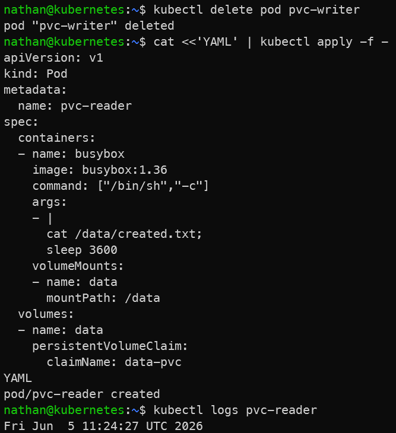

# Étape 4 – Prouver la persistance après recréation

**Supprimer le pod et en créer un nouveau lisant la donnée :**

```bash
kubectl delete pod pvc-writer
```

```yaml
cat <<'YAML' | kubectl apply -f -
apiVersion: v1
kind: Pod
metadata:
  name: pvc-reader
spec:
  containers:
  - name: busybox
    image: busybox:1.36
    command: ["/bin/sh","-c"]
    args:
    - |
      cat /data/created.txt;
      sleep 3600
    volumeMounts:
    - name: data
      mountPath: /data
  volumes:
  - name: data
    persistentVolumeClaim:
      claimName: data-pvc
YAML
```

**Observer :**

```bash
kubectl logs pvc-reader
```

**Constat attendu :**

- le nouveau pod `pvc-reader` relit le fichier créé par le pod précédent,

- la donnée survit à la suppression du pod pvc-writer,

- le PVC conserve l’état indépendamment du cycle de vie des pods qui le montent.

<details>

<summary><strong>Résultat</strong></summary>



**Interprétation :**

Le pod `pvc-writer` est supprimé, mais le PVC n’est pas supprimé. Le nouveau pod `pvc-reader` monte le même volume et retrouve le fichier créé précédemment.

Cela montre que les données stockées dans un volume persistant survivent à la suppression d’un pod. Le pod peut être considéré comme remplaçable, tandis que le PVC porte l’état à conserver.

</details>
