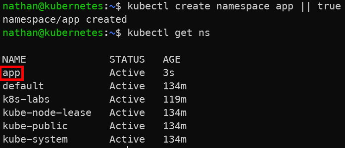

# Étape 1 – Créer un namespace dédié

```bash
kubectl create namespace app || true
kubectl get ns
```

*Les labs 1 à 4, 6, 7 et 8 utilisent le namespace courant k8s-labs. Le Lab 5 utilise volontairement un namespace séparé app pour démontrer l’isolation et RBAC.*

**Constat attendu** : le namespace `app` existe et isole son espace de noms.

<details>

<summary><strong>Résultat</strong></summary>

****

**Interprétation :**

Le namespace `app` crée un espace logique séparé dans le cluster. Les ressources créées dans ce namespace sont isolées des ressources présentes dans le namespace default ou dans les autres namespaces.

Cette séparation facilite l’organisation des workloads, l’application de permissions spécifiques et la limitation du périmètre d’administration.

</details>
