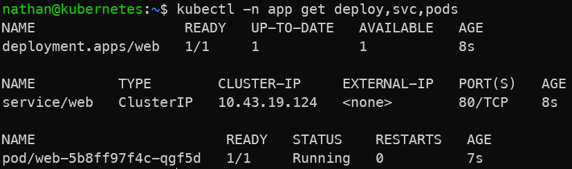

# Étape 2 – Déployer une application dans ce namespace

```yaml
cat <<'YAML' | kubectl -n app apply -f -
apiVersion: apps/v1
kind: Deployment
metadata:
  name: web
spec:
  replicas: 1
  selector:
    matchLabels:
      app: web
  template:
    metadata:
      labels:
        app: web
    spec:
      containers:
      - name: nginx
        image: nginx:1.25
        ports:
        - containerPort: 80
---
apiVersion: v1
kind: Service
metadata:
  name: web
spec:
  selector:
    app: web
  ports:
  - port: 80
    targetPort: 80
YAML
```

```bash
kubectl -n app get deploy,svc,pods
```

**Constat attendu** : les ressources sont visibles avec `-n app`, pas dans le namespace courant.

<details>

<summary><strong>Résultat</strong></summary>



**Interprétation :**

Les ressources de l’application sont visibles avec l’option `-n app`, car elles appartiennent au namespace `app`. Elles n’apparaissent pas dans le namespace courant si celui-ci est différent.

Cette étape montre que le namespace fait partie de l’identité complète d’une ressource Kubernetes. Deux ressources peuvent avoir le même nom dans deux namespaces différents sans entrer en conflit.

</details>
