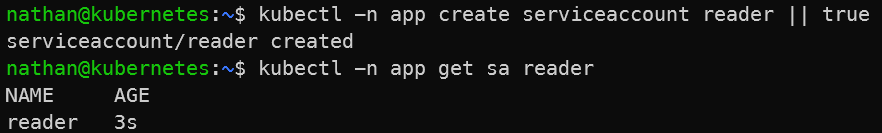

# Étape 3 – Créer une identité : ServiceAccount

```bash
kubectl -n app create serviceaccount reader || true
kubectl -n app get sa reader
```

**Constat attendu :**

- le ServiceAccount `reader` est créé dans le namespace `app` ,

- cette identité pourra être utilisée pour appliquer des droits spécifiques,

- aucun droit applicatif n’est accordé tant qu’aucun RoleBinding ne lui est associé.

<details>

<summary><strong>Résultat</strong></summary>



**Interprétation :**

Le ServiceAccount `reader` est une identité Kubernetes utilisable par une application, un pod ou un processus automatisé. Sa création ne donne pas automatiquement de droits applicatifs.

Les permissions doivent être accordées explicitement avec RBAC. Cette séparation entre identité et autorisation permet d’attribuer uniquement les droits nécessaires.

</details>
