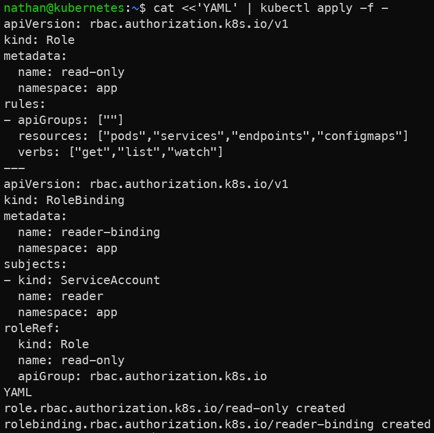

# Étape 4 – Définir une politique RBAC “lecture seule”

**Créer un rôle minimal (pods/services/endpoints/configmaps) et le binder au ServiceAccount.**

```yaml
cat <<'YAML' | kubectl apply -f -
apiVersion: rbac.authorization.k8s.io/v1
kind: Role
metadata:
  name: read-only
  namespace: app
rules:
- apiGroups: [""]
  resources: ["pods","services","endpoints","configmaps"]
  verbs: ["get","list","watch"]
---
apiVersion: rbac.authorization.k8s.io/v1
kind: RoleBinding
metadata:
  name: reader-binding
  namespace: app
subjects:
- kind: ServiceAccount
  name: reader
  namespace: app
roleRef:
  kind: Role
  name: read-only
  apiGroup: rbac.authorization.k8s.io
YAML
```

**Constat attendu :**

- le Role `read-only` définit uniquement des permissions de lecture,

- le RoleBinding associe ces permissions au ServiceAccount `reader`,

- les droits sont limités au namespace `app`.

<details>

<summary><strong>Résultat</strong></summary>



**Interprétation :**

Le Role `read-only` définit un ensemble limité d’actions autorisées, principalement des opérations de lecture. Le RoleBinding associe ces permissions au ServiceAccount `reader`.

Les droits sont limités au namespace `app`. Le ServiceAccount ne reçoit donc pas de permissions globales sur le cluster, ce qui réduit son périmètre d’action.

</details>
