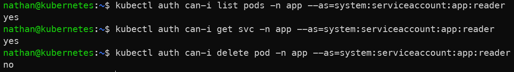
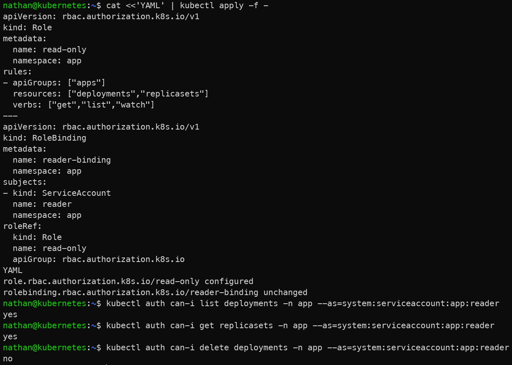

# Étape 5 – Tester les droits avec `kubectl auth can-i`

**Valider précisément ce qui est autorisé/interdit.**

```bash
kubectl auth can-i list pods -n app --as=system:serviceaccount:app:reader
kubectl auth can-i get svc -n app --as=system:serviceaccount:app:reader
kubectl auth can-i delete pod -n app --as=system:serviceaccount:app:reader
```

**Constat attendu :**
- `list/get` OK,
- `delete` refusé.

**Optionnel** : autoriser la lecture des deployments (`apiGroups: ["apps"]`, `resources: ["deployments","replicasets"]`) puis re-tester.

<details>

<summary><strong>Résultat</strong></summary>





**Interprétation :**

Les commandes `kubectl auth can-i` confirment concrètement les permissions accordées au ServiceAccount. Les actions de lecture sont autorisées, tandis que l’action de suppression est refusée.

Cette vérification est essentielle : elle permet de valider que la politique RBAC appliquée correspond bien au comportement attendu, sans se limiter à lire le manifeste YAML.

</details>
