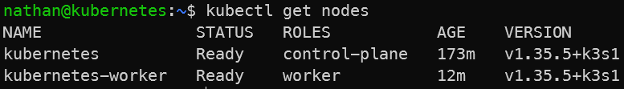

# Pré-requis

- Idéalement un cluster avec **au moins 2 nœuds**.

**Vérifier** :

```bash
kubectl get nodes
```

Pour configurer un deuxième noeud, il faut créer une autre machine type linux puis suivre cette procédure :

Sur le noeud principal (le control-plane, "kubernetes" dans nos exercices), il faut récupèrer d’abord l’adresse IP du serveur K3s :

```text
hostname -I
```

Puis récupèrer le token de jointure :

```text
sudo cat /var/lib/rancher/k3s/server/node-token
```

*Le token de jointure permet d’ajouter un nœud au cluster. Il doit être traité comme une donnée sensible et ne doit pas être partagé dans un compte rendu, une capture d’écran ou un dépôt Git.*

Sur la nouvelle machine, installer l’agent K3s avec :

```text
curl -sfL https://get.k3s.io | K3S_URL=https://<IP_DU_SERVEUR>:6443 K3S_TOKEN=<TOKEN> sh -
```

**Exemple :**

```text
curl -sfL https://get.k3s.io | K3S_URL=https://<IP_DU_SERVEUR>:6443 K3S_TOKEN=<TOKEN> sh -
```

<details>

<summary>**Résultat**</summary>



**Interprétation :**

La commande `kubectl get nodes` permet de vérifier que le cluster dispose bien des nœuds nécessaires aux exercices. Le nœud control-plane héberge les composants de contrôle, tandis que le nœud worker permet d’observer les mécanismes de scheduling dans un contexte plus réaliste.

Si un seul nœud apparaît, les labs restent partiellement réalisables, mais les exercices liés aux taints, tolerations, nodeSelector et anti-affinité seront moins démonstratifs.

</details>
