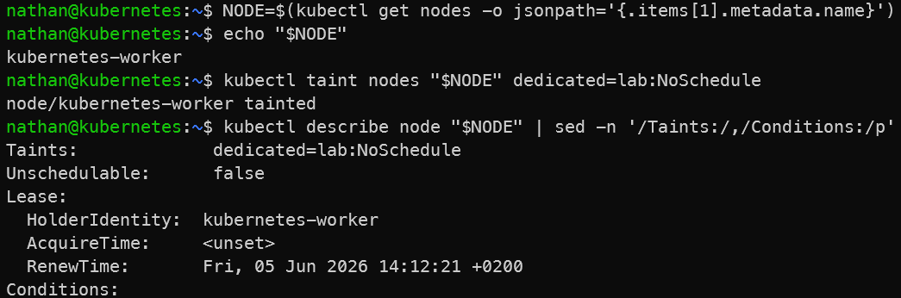

# Étape 1 – Sélectionner un nœud et appliquer un taint

```bash
NODE=$(kubectl get nodes \
  --selector='!node-role.kubernetes.io/control-plane' \
  -o jsonpath='{.items[0].metadata.name}')
```

```text
echo "$NODE"
```

```bash
kubectl taint nodes "$NODE" dedicated=lab:NoSchedule
kubectl describe node "$NODE" | sed -n '/Taints:/,/Conditions:/p'
```

**Constat attendu :**

- le nœud sélectionné possède le taint `dedicated=lab:NoSchedule`,

- Kubernetes évitera d’y planifier les pods qui ne tolèrent pas explicitement ce taint,

- le taint agit comme une contrainte d’exclusion au niveau du scheduler.

<details>

<summary><strong>Résultat</strong></summary>



**Interprétation :**

Le nœud sélectionné possède maintenant un taint `dedicated=lab:NoSchedule`. Ce taint indique au scheduler que les pods qui ne le tolèrent pas ne doivent pas être planifiés sur ce nœud.

Le taint agit comme une protection côté nœud. Il permet de réserver ou d’isoler certains nœuds pour des usages spécifiques.

</details>
