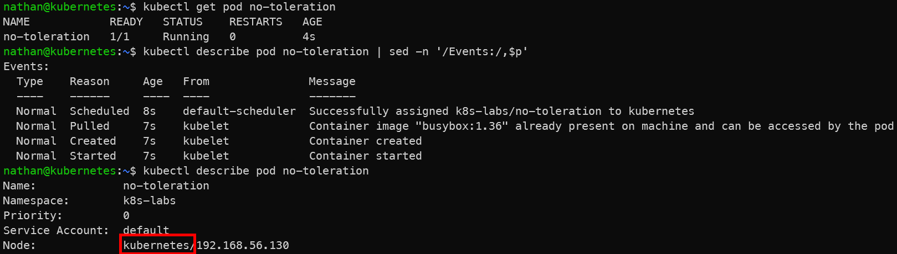

# Étape 2 – Déployer un pod sans toleration

```yaml
cat <<'YAML' | kubectl apply -f -
apiVersion: v1
kind: Pod
metadata:
  name: no-toleration
spec:
  containers:
  - name: pause
    image: busybox:1.36
    command: ["/bin/sh","-c","sleep 3600"]
YAML
```

```bash
kubectl get pod no-toleration
kubectl describe pod no-toleration | sed -n '/Events:/,$p'
```

**Constat attendu :**

- sur un cluster 1 nœud : `Pending` avec événement “taint not tolerated”,

- sur multi-nœuds : il peut être planifié ailleurs (normal).

<details>

<summary><strong>Résultat</strong></summary>



**Interprétation :**

Un pod sans toleration ne peut pas être planifié sur le nœud tainté. Si le cluster ne contient qu’un seul nœud éligible, le pod reste en `Pending` avec un événement indiquant que le taint n’est pas toléré.

Dans un cluster multi-nœuds, le pod peut être placé sur un autre nœud non tainté. Ce comportement est normal : le taint n’empêche pas le pod d’exister, il limite simplement les nœuds sur lesquels il peut être planifié.

Si le pod est planifié sur un autre nœud, ce n’est pas une erreur : cela confirme que le taint ne bloque que le nœud tainté, pas le pod lui-même.

</details>
