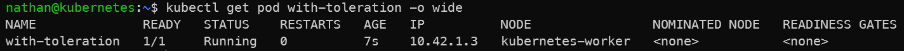

# Étape 3 – Ajouter une toleration

```bash
kubectl delete pod no-toleration --ignore-not-found
```

```yaml
cat <<'YAML' | kubectl apply -f -
apiVersion: v1
kind: Pod
metadata:
  name: with-toleration
spec:
  tolerations:
  - key: "dedicated"
    operator: "Equal"
    value: "lab"
    effect: "NoSchedule"
  containers:
  - name: pause
    image: busybox:1.36
    command: ["/bin/sh","-c","sleep 3600"]
YAML
```

```bash
kubectl get pod with-toleration -o wide
```

**Constat attendu :**

- le pod with-toleration peut être planifié sur le nœud tainté,

- la toleration n’oblige pas Kubernetes à choisir ce nœud,

- elle autorise simplement le scheduler à l’utiliser malgré le taint.

<details>

<summary><strong>Résultat</strong></summary>



**Interprétation :**

La toleration permet au pod `with-toleration` d’être accepté sur le nœud portant le taint correspondant. Le scheduler peut donc utiliser ce nœud si les autres contraintes de placement sont satisfaites.

Il ne faut pas confondre autorisation et obligation : une toleration autorise le placement sur un nœud tainté, mais elle ne force pas Kubernetes à choisir ce nœud.

</details>
