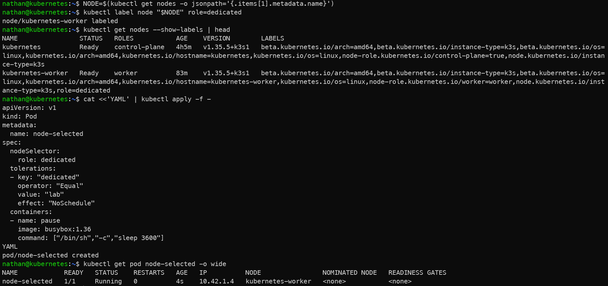

# Étape 4 – NodeSelector

*Si vous avez ouvert un nouveau terminal depuis l’étape précédente, réexécutez la commande de sélection du nœud pour réinitialiser la variable NODE.*

```bash
kubectl label node "$NODE" role=dedicated
kubectl get nodes --show-labels | head
```

```yaml
cat <<'YAML' | kubectl apply -f -
apiVersion: v1
kind: Pod
metadata:
  name: node-selected
spec:
  nodeSelector:
    role: dedicated
  tolerations:
  - key: "dedicated"
    operator: "Equal"
    value: "lab"
    effect: "NoSchedule"
  containers:
  - name: pause
    image: busybox:1.36
    command: ["/bin/sh","-c","sleep 3600"]
YAML
```

```bash
kubectl get pod node-selected -o wide
```

**Constat attendu :**

- le label `role=dedicated` est appliqué au nœud sélectionné,

- le pod `node-selected` ne peut être planifié que sur un nœud portant ce label,

- la toleration permet au pod d’être accepté sur le nœud tainté.

<details>

<summary><strong>Résultat</strong></summary>



**Interprétation :**

Le label `role=dedicated` est ajouté au nœud sélectionné. Le nodeSelector du pod impose ensuite que le pod soit planifié uniquement sur un nœud portant ce label.

Dans ce scénario, le pod combine deux mécanismes : le nodeSelector attire le pod vers un nœud précis, tandis que la toleration lui permet d’être accepté malgré le taint présent sur ce nœud.

</details>
