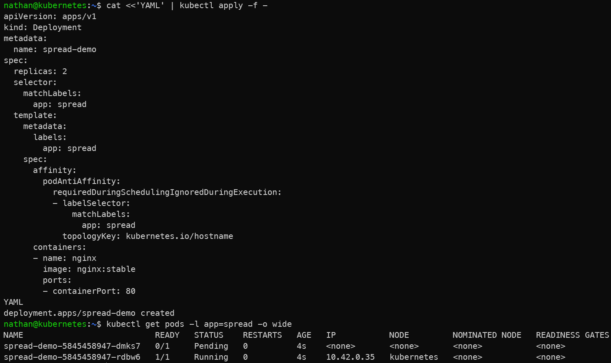

# Étape 5 – Anti-affinité (si multi-nœuds)

```yaml
cat <<'YAML' | kubectl apply -f -
apiVersion: apps/v1
kind: Deployment
metadata:
  name: spread-demo
spec:
  replicas: 2
  selector:
    matchLabels:
      app: spread
  template:
    metadata:
      labels:
        app: spread
    spec:
      affinity:
        podAntiAffinity:
          requiredDuringSchedulingIgnoredDuringExecution:
          - labelSelector:
              matchLabels:
                app: spread
            topologyKey: kubernetes.io/hostname
      containers:
      - name: nginx
        image: nginx:1.25
        ports:
        - containerPort: 80
YAML
```

```bash
kubectl get pods -l app=spread -o wide
```

**Constat attendu :**

- les deux replicas cherchent à être répartis sur des nœuds différents,

- la règle d’anti-affinité empêche deux pods portant `app=spread` d’être placés sur le même hostname,

- si le cluster ne dispose pas d’assez de nœuds éligibles, un pod peut rester Pending.

<details>

<summary><strong>Résultat</strong></summary>



**Interprétation :**

L’anti-affinité demande au scheduler de ne pas placer deux pods identiques sur le même hostname. L’objectif est de répartir les replicas sur plusieurs nœuds afin de limiter l’impact d’une panne d’un nœud.

Si le cluster ne dispose pas d’assez de nœuds compatibles, un des pods peut rester Pending. Ce résultat est cohérent : Kubernetes respecte la contrainte de placement plutôt que de concentrer les pods sur un seul nœud.

</details>
