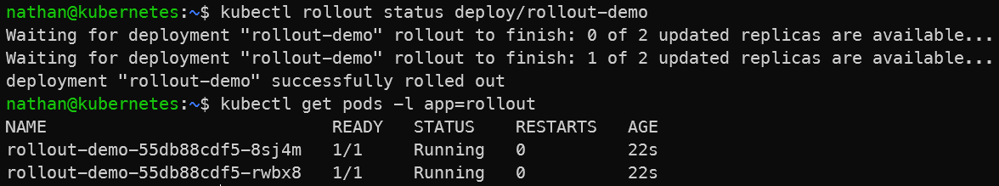

# Étape 1 – Déployer une version stable (v1)

```yaml
cat <<'YAML' | kubectl apply -f -
apiVersion: apps/v1
kind: Deployment
metadata:
  name: rollout-demo
spec:
  replicas: 2
  selector:
    matchLabels:
      app: rollout
  template:
    metadata:
      labels:
        app: rollout
    spec:
      containers:
      - name: nginx
        image: nginx:1.25
        ports:
        - containerPort: 80
YAML
```

```bash
kubectl rollout status deploy/rollout-demo
kubectl get pods -l app=rollout
```

**Constat attendu :**

- le Deployment rollout-demo crée deux pods nginx en version 1.25,

- le rollout se termine correctement,

- les pods sont disponibles et gérés par un ReplicaSet.

<details>

<summary><strong>Résultat</strong></summary>



**Interprétation :**

Le Deployment `rollout-demo` crée deux pods utilisant l’image `nginx:1.25`. Le rollout se termine correctement lorsque les replicas attendus sont disponibles.

Cette étape établit un état de référence stable. Kubernetes connaît une première révision fonctionnelle du Deployment, qui pourra ensuite servir de point de comparaison ou de retour arrière.

</details>
