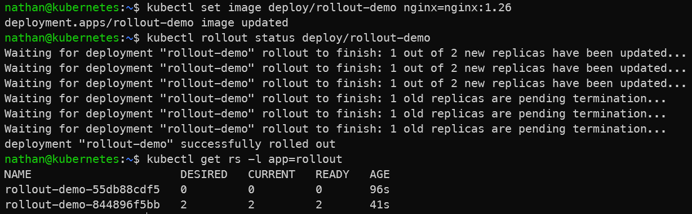

# Étape 2 – Déclencher une mise à jour (v2)

```bash
kubectl set image deploy/rollout-demo nginx=nginx:1.26
kubectl rollout status deploy/rollout-demo
kubectl get rs -l app=rollout
```

**Constat attendu :**

- Kubernetes crée un nouveau ReplicaSet pour la version nginx:1.26,

- les nouveaux pods remplacent progressivement les anciens,

- l’historique du Deployment conserve la trace de cette révision.

<details>

<summary><strong>Résultat</strong></summary>



**Interprétation :**

La modification de l’image déclenche une nouvelle révision du Deployment. Kubernetes crée un nouveau ReplicaSet pour porter la nouvelle version, puis remplace progressivement les anciens pods.

Ce mécanisme permet de mettre à jour une application sans supprimer brutalement l’ensemble des instances existantes. L’historique du rollout conserve les révisions successives.

</details>
