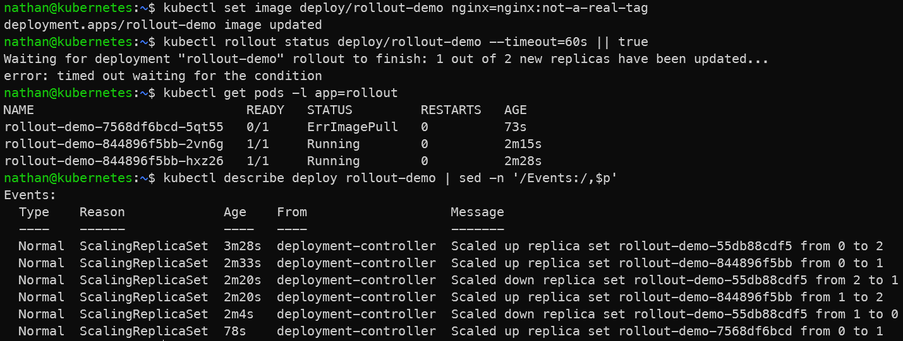

# Étape 3 – Introduire une version défectueuse

```bash
kubectl set image deploy/rollout-demo nginx=nginx:not-a-real-tag
kubectl rollout status deploy/rollout-demo --timeout=60s || true
kubectl get pods -l app=rollout
kubectl describe deploy rollout-demo | sed -n '/Events:/,$p'
```

**Constat attendu :**

- le rollout ne se termine pas correctement,

- les nouveaux pods restent en erreur de pull d’image,

- les anciens pods fonctionnels peuvent rester disponibles selon la stratégie de mise à jour du Deployment.

<details>

<summary><strong>Résultat</strong></summary>



**Interprétation :**

L’image `nginx:not-a-real-tag` n’existe pas, ce qui empêche les nouveaux pods de démarrer correctement. Le rollout ne peut donc pas se terminer.

Les anciens pods peuvent rester disponibles selon la stratégie de mise à jour. Cela illustre l’intérêt du Deployment : une mise à jour défectueuse ne remplace pas nécessairement immédiatement toute la version fonctionnelle.

</details>
