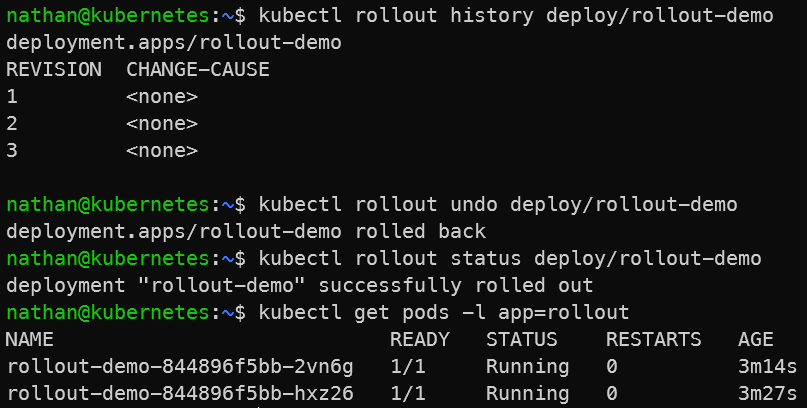

# Étape 4 – Rollback

```bash
kubectl rollout history deploy/rollout-demo
kubectl rollout undo deploy/rollout-demo
kubectl rollout status deploy/rollout-demo
kubectl get pods -l app=rollout
```

**Optionnel** : rollback vers une révision précise.

```bash
kubectl rollout history deploy/rollout-demo
kubectl rollout undo deploy/rollout-demo --to-revision=2
```

**Constat attendu :**

- Kubernetes restaure une révision précédente du Deployment,

- les pods défectueux sont remplacés par des pods utilisant une image valide,

- le rollout redevient stable après le retour arrière.

<details>

<summary><strong>Résultat</strong></summary>



**Interprétation :**

Le rollback restaure une révision précédente du Deployment. Kubernetes abandonne la version défectueuse et recrée des pods avec une image valide.

Le rollout redevient stable lorsque les nouveaux pods sont disponibles. Cette étape montre que l’historique des révisions permet de revenir rapidement à un état fonctionnel après une mise à jour incorrecte.

</details>
