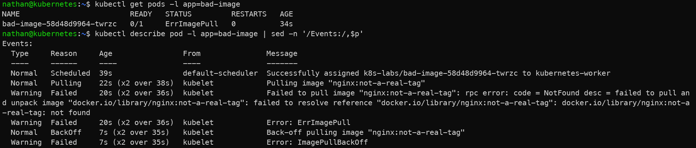
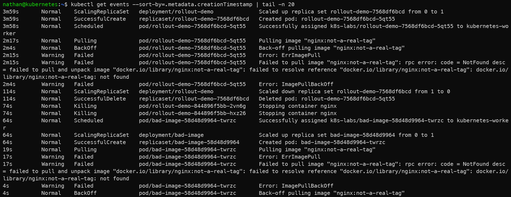

# Scénario A – Erreur de pull d’image (ErrImagePull)

```yaml
cat <<'YAML' | kubectl apply -f -
apiVersion: apps/v1
kind: Deployment
metadata:
  name: bad-image
spec:
  replicas: 1
  selector:
    matchLabels:
      app: bad-image
  template:
    metadata:
      labels:
        app: bad-image
    spec:
      containers:
      - name: app
        image: nginx:not-a-real-tag
YAML
```

```bash
kubectl get pods -l app=bad-image
kubectl describe pod -l app=bad-image | sed -n '/Events:/,$p'
kubectl get events --sort-by=.metadata.creationTimestamp | tail -n 20
```

**Constat attendu :**

- le pod ne démarre pas car l’image `nginx:not-a-real-tag` n’existe pas,

- l’état du pod indique `ErrImagePull` ou `ImagePullBackOff`,

- les événements Kubernetes donnent la cause précise de l’échec.

<details>

<summary><strong>Résultat</strong></summary>





**Interprétation :**

Le pod ne démarre pas, car Kubernetes ne parvient pas à récupérer l’image demandée. Les états `ErrImagePull` puis `ImagePullBackOff` indiquent un échec de téléchargement de l’image depuis le registre.

La commande `describe` et les événements permettent d’identifier la cause précise : nom d’image incorrect, tag inexistant, registre inaccessible ou problème d’authentification. Dans ce scénario, le tag `nginx:not-a-real-tag` est volontairement invalide.

</details>
