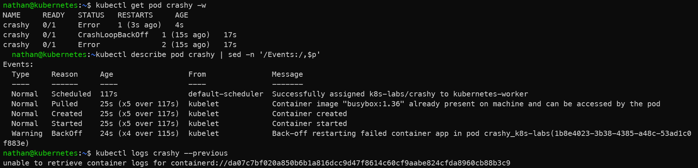

# Scénario B – CrashLoopBackOff

```yaml
cat <<'YAML' | kubectl apply -f -
apiVersion: v1
kind: Pod
metadata:
  name: crashy
spec:
  restartPolicy: Always
  containers:
  - name: app
    image: busybox:1.36
    command: ["/bin/sh","-c","echo boom; exit 1"]
YAML
```

```bash
kubectl get pod crashy -w
kubectl describe pod crashy | sed -n '/Events:/,$p'
kubectl logs crashy --previous
```

**Constat attendu :**

- le conteneur démarre puis s’arrête immédiatement avec un code d’erreur,

- Kubernetes tente de le redémarrer automatiquement,

- les logs précédents permettent d’identifier la cause applicative du crash.

<details>

<summary><strong>Résultat</strong></summary>



**Interprétation :**

Le conteneur démarre, exécute sa commande, puis se termine immédiatement avec un code d’erreur. Kubernetes tente alors de le redémarrer automatiquement, ce qui provoque une boucle de crash.

L’état `CrashLoopBackOff` indique que le problème vient du comportement du processus dans le conteneur, et non d’un problème de scheduling ou de téléchargement d’image. Les logs, notamment avec `--previous`, permettent d’analyser la sortie du conteneur avant son dernier redémarrage.

</details>
