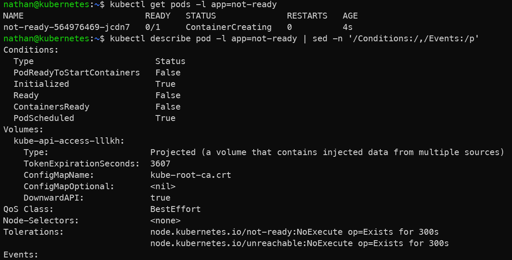
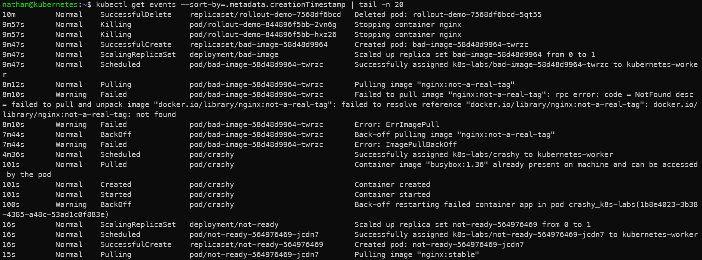

# Scénario C – Running mais NotReady (readiness)

```yaml
cat <<'YAML' | kubectl apply -f -
apiVersion: apps/v1
kind: Deployment
metadata:
  name: not-ready
spec:
  replicas: 1
  selector:
    matchLabels:
      app: not-ready
  template:
    metadata:
      labels:
        app: not-ready
    spec:
      containers:
      - name: nginx
        image: nginx:1.25
        readinessProbe:
          httpGet:
            path: /this-does-not-exist
            port: 80
          periodSeconds: 2
          failureThreshold: 2
YAML
```

```bash
kubectl get pods -l app=not-ready
kubectl describe pod -l app=not-ready | sed -n '/Conditions:/,/Events:/p'
kubectl get events --sort-by=.metadata.creationTimestamp | tail -n 20
```

**Constat attendu :**

- le conteneur `nginx` est en cours d’exécution,

- le pod reste `NotReady` car la readiness probe échoue,

- Kubernetes ne considère pas ce pod comme éligible pour recevoir du trafic via un Service.

<details>

<summary><strong>Résultat</strong></summary>





**Interprétation :**

Le conteneur `nginx` est bien démarré, donc le pod peut apparaître en `Running`. Cependant, la readiness probe échoue, ce qui empêche le pod d’être marqué comme `Ready`.

Cette situation montre qu’un pod peut être actif sans être considéré comme disponible pour recevoir du trafic. Kubernetes retire alors ce pod des endpoints des Services qui l’utilisent.

</details>
