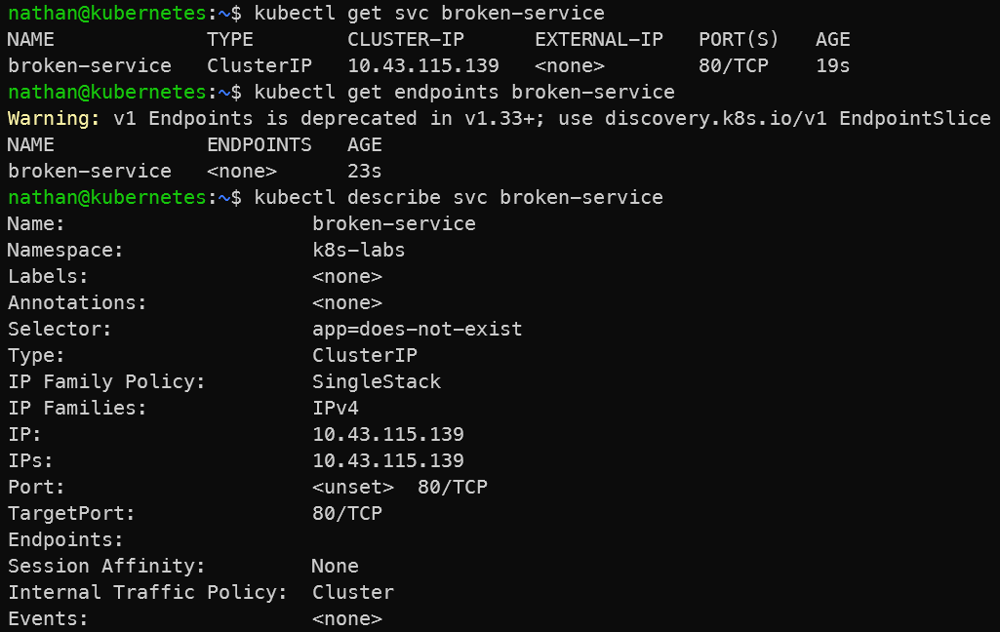

# Scénario D – Service sans endpoints

```yaml
cat <<'YAML' | kubectl apply -f -
apiVersion: v1
kind: Service
metadata:
  name: broken-service
spec:
  selector:
    app: does-not-exist
  ports:
  - port: 80
    targetPort: 80
YAML
```

```bash
kubectl get svc broken-service
```

```bash
kubectl get endpoints broken-service
```

```bash
kubectl describe svc broken-service
```

**Constat attendu :**

- le Service existe et possède une IP ClusterIP,

- aucun endpoint n’est associé car son selector ne correspond à aucun pod,

- le Service ne peut pas router de trafic tant qu’aucun pod Ready ne correspond à ses labels.

<details>

<summary><strong>Résultat</strong></summary>



**Interprétation :**

Le Service `broken-service` existe et possède une adresse ClusterIP, mais il ne dispose d’aucun endpoint. Cela signifie qu’aucun pod `Ready` ne correspond à son selector.

Le problème ne vient pas de la création du Service, mais de l’absence de cible réseau. Pour corriger ce type d’incident, il faut comparer le selector du Service avec les labels des pods et vérifier que les pods correspondants sont bien `Ready`.

</details>
